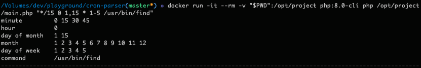

# cron-parser
[](https://github.com/khalidumarr/cron-parser/actions/workflows/php.yml)

<p>This small library parses the cron string and display next run times for each field.<br>
Timing of each cron field (i.e. minute, hour) is isoladed and based on its own unit of time. </p>

### Example
Following command:
```
 php main.php "*/30 1 1,2 * 1-2 /test"  
```
Will output:
```
minute         0 30
hour           1
day of month   1 2
month          1 2 3 4 5 6 7 8 9 10 11 12
day of week    1 2
command        /test
```

## Dependencies
- docker image ```php:8.0-cli```
- php > ```8.0```
- composer ```2.1.8``` (already added to repository)
- phpunit ```9.5``` (already added to repository)

## Steps to Execute
without Docker:
```
composer.phar install
php main.php "{CRON_STRING} {COMMAND}"  
```

with Docker:
```
docker run -it --rm -v "$PWD":/opt/project php:8.0-cli /opt/project/composer.phar install --working-dir=/opt/project
docker run -it --rm -v "$PWD":/opt/project php:8.0-cli php /opt/project/main.php "{CRON_STRING} {COMMAND}"
```


## Steps to Run Tests
without Docker:<br>
(execute in repository main directory)
```
php phpunit-9.5.phar --configuration phpunit.xml.dist tests
```

with docker:<br>
```
docker run -it --rm -v "$PWD":/opt/project php:8.0-cli /opt/project/phpunit-9.5.phar --configuration /opt/project/phpunit.xml.dist /opt/project/tests
```
## Code structure

Code is devided in three main sections
- inputs
- parsers
- outputs

`InputTaker` class relies on `InputInterface`, which means input can come from various sources. For now its taking from Command line arguments (added `CommandLineInput` class to take input from STDIN just for demonstration)<br>

Each section of CRON string (i.e. `* {SECTION} * * *`) is called `Field` and it has defined min and max limit. Parsers are used irrespective of type of field and there is a factory which determines which parser to initialize based on type of delimeter present in parameter. <br>

In the end, When next run times are determined by `CronProcessor` result which is object of `Cron` is passed to Output class for display.
Just like Input, Output can also be in different forms e.g. file, stdout, db
explainition
## Known Issues
- Test coverage is not full yet (Currently at 80%), also the number of test cases are bit limited. 
- Not accepting Week days by name (ex: SUN, MON)
- Not accepting Month names (ex: JAN, FEB)
- List is not accepted in frequency type fields (ex: 1,3/2 * * * *)

## Test Cover Report (from last run)
Check [Report](https://htmlpreview.github.io/?https://github.com/khalidumarr/cron-parser/blob/master/test-results.html) for detailed coverage information.
## Actual Demo Output

